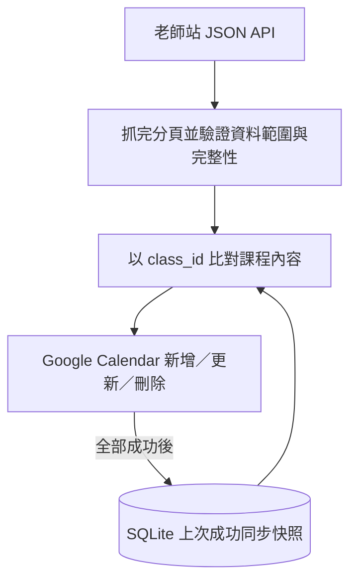

# 課表同步與 VPS Docker 部署計畫

檢查日期：2026-09-10。範圍：教師手冊全部 3 份 PDF、14 張補充圖片，以及目前 course-robot 的核心程式、測試、設定及部署檔。這份文件記錄分析與下一步；尚未修改同步程式、連線 VPS 或寫入 Google Calendar。

## 目標與資料流

在 VPS 上執行一個 Docker Compose worker，定期登入支點老師站、取得完整課表，僅把需要異動的課程同步到指定 Google Calendar。

網站回應是課程狀態的依據。SQLite 保存最後成功套用至 Calendar 的快照及事件 ID，目的是避免重寫，並可在必要時重建。Calendar 是單向輸出。沿用目前 JSON API 爬取方式；現有 API 可用時，無須加入瀏覽器常駐、前端服務或獨立資料庫伺服器。

## 教師手冊對同步規則的影響

| 手冊內容 | 程式應如何處理 |
|---|---|
| 後台「我的課表」為準；Email 可能延遲或暫停 | 直接定期取得老師站課表，持續同步新增及調整 |
| 放課時段可在課前 24 小時以前持續媒合，成功後直接預約 | 區分可被預約的時段與已成立課程；現階段以已成立課程為同步目標 |
| 學生取消課程，不等於教師取消放課 | 課程消失只影響相應日曆事件，不推論可授課時段也已取消 |
| 存在 25 分鐘、50 分鐘及兩／三堂連堂；連堂在第一間教室連續授課 | 核對 API 的起訖時間、課時及節次語意；保留來源 ID，先不合併不同課程 |
| 指定進度優先；未指定時依前堂評鑑接續，章節順序依課表安排 | Calendar 標題呈現網站表定章節；不能僅由標題推論實際備課進度 |
| 教材更新以雲端版本為準 | 保留來源提供的教材、解答連結，網址變更也納入同步 |
| 課後評鑑當日完成；另有出勤、教室操作、請假證明及計薪規則 | 已閱讀作為業務背景；第一階段仍集中完成課表同步 |

主要依據：守則第 3～9 頁、系統操作第 8～11、19～26 頁，以及放課、進度判斷、教材、評鑑補充圖片。2026 計薪公告是獨立的計薪／發薪日期資料，不決定課程是否存在。

## 目前已實作

- `api.py`：POST `/api/teacher/login`，取得 Bearer token 後分頁 GET `/api/teacher/daily-schedule`。
- `models.py`：正規化時間為 Asia/Taipei，抽出學生、章節、教室、主要教材及解答，以內容雜湊比較變更。
- `database.py`：以 `class_id` 對應的 `source_id` 比對快照；已拒絕重複 ID，以及未明確允許的空快照；不保存長期異動歷史。
- `google_calendar.py`：穩定事件 ID、private 事件、管理標記，支援新增、修改及刪除。標題為學生與章節，說明含教材與教室連結。
- `cli.py`：提供授權、權限檢查、異動預覽、同步及報表。啟用 Calendar 時，所有 Calendar 操作成功後才替換 SQLite 快照。
- Docker：多階段建置、非 root UID/GID 10001、唯讀根檔案系統、持久化 data、日誌輪替、健康檢查、重啟政策，啟動後立即同步，完成後等待預設 900 秒再同步。
- HTML／CSV 報表是選配；Compose 停用報表且不開放連接埠。OAuth 公開說明頁與 worker 分開部署。

## 已確認的問題與待驗證項目

### 優先修正：避免錯誤刪除與漏同步

1. **不完整分頁仍被接受**（`api.py:114`）。離線模擬 `meta.total=2`，第一頁只有 1 筆、第二頁為空，結果仍成功返回 1 筆。現有程式也會在超過 total 時截斷資料。應驗證分頁 total 一致、實際筆數相符、結構完整，不符合即停止，不能把缺頁當作課程取消。
2. **`--no-calendar` 會消耗尚未同步的差異**（`cli.py:133`、`database.py:212`）。已重現：先保存新章節但保留既有 mapping，下次 Calendar 計畫為 0 次寫入；先保存課程刪除，下次計畫也沒有刪除事件。建議讓 Calendar 快照只在 Calendar 成功後前進；抓取／除錯預覽使用記憶體或獨立輸出，不覆蓋該檢查點。只清掉現有 mapping 不能找回已遺失的刪除資訊。
3. **來源消失的語意未驗證**。目前任何舊 ID 沒出現在新快照就會刪除 Calendar 事件。必須確認 API 是全部課程還是滾動時間窗，並區分取消與課程自然過期。建議預設保留已上完的日曆紀錄，只有完整查詢範圍內確認消失的未來課程才刪除；需先以實際 API 行為驗證。
4. **缺少結束時間時硬補 50 分鐘**（`google_calendar.py:61`）。不符合所有手冊情境。現有本機 84 筆資料的起訖差是 75 筆 30 分鐘、9 筆 60 分鐘；這只是舊快照現象，尚未證明是預約時段或實際課時。先對照老師站 UI/API；不明資料應報錯或隔離，不自行猜測長度。

### 上線前補齊：中斷、恢復與維運

- HTTP 暫時失敗目前主要等待下一輪，沒有請求層的有限重試。新增網路錯誤、429、可重試的 5xx 與 rate-limit 403 的指數退避；權限型 403 不盲目重試。Google 官方依據：[Calendar error handling](https://developers.google.com/workspace/calendar/api/guides/errors)。
- Calendar 無跨事件交易：即使 SQLite 沒更新，前面成功的 Calendar 寫入也不會回滾。補「中途失敗、重跑、期間來源再變動」案例，並提供手動 reconcile，掃描管理標記來修復遺漏或孤立事件。
- `insert_event` 的 409 與 `patch_event` 的 404／410 目前會互相呼叫；需限制恢復次數，測試已刪除事件 ID 再使用等情況，避免持續遞迴。
- SQLite 未綁定目標 Calendar ID；更換 Calendar 可能把舊 mapping 當成新目標已同步。保存同步目標，變更目標時進行明確的重建／reconcile。
- `calendar-plan` 雖不更新課程快照，但使用會建表與遷移 schema 的 `connect()`；應改成真正唯讀，資料庫不存在時在記憶體產生計畫。
- 新增跨程序同步鎖，避免 worker 與手動同步同時操作同一快照；停止訊號要覆蓋正在進行的同步程序，token 改為暫存檔後原子替換。
- 健康檢查應反映最後成功完成 Calendar 同步，而不是單純抓取成功。補失敗分類、耗時與最後成功時間，以及連續失敗／恢復通知。
- Compose healthcheck 不等於告警或自動修復；目前主程序會捕捉同步失敗並繼續等待。Docker restart policy 主要作用於容器退出或 daemon 重啟：[Docker restart policies](https://docs.docker.com/engine/containers/start-containers-automatically/)。

## 下一步執行順序及驗收

| 階段 | 工作 | 完成條件 |
|---|---|---|
| 1. 核對來源 | 唯讀登入老師站，對照 API/UI 的課時、連堂、查詢範圍、取消表示及穩定 ID；保存去識別化測試樣本 | 明確定義哪些資料可新增、更新、刪除，不依推測解讀欄位 |
| 2. 修正同步正確性 | 完整分頁驗證、修正 no-calendar 快照行為、有效起訖時間驗證、刪除範圍規則、預覽唯讀 | 不完整回應與預覽不變更正式狀態；不漏套用變更；相同資料第二次為零 Calendar 寫入 |
| 3. 補恢復與容器行為 | 有限重試、同步鎖、停止訊號、token 原子寫入、目標綁定及手動 reconcile | 斷線、中斷、重啟、DB 遺失可恢復；不產生重複或無法清除的管理事件 |
| 4. Google 測試日曆驗證 | 確認 OAuth Production、refresh token 可更新、目標日曆可寫；以隔離測試日曆驗證新增／修改／取消 | 直接核對 Calendar 的事件 ID、時間、內容及第二次零寫入，測試不只停在 plan |
| 5. VPS 部署及觀察 | 檢查 VPS OS／架構／Docker／Compose；部署單 worker，傳送 secrets 及檢查點，設定 data 權限；運行至少 48 小時 | 容器真實 build/start 成功、重啟不遺失狀態、跨日同步正常、能更新 token、健康檢查和失敗／恢復通知有效 |

Google External／Testing 使用 Calendar scope 時，refresh token 有 7 天期限；長期部署前需確認 Publishing status，必要時切至 Production 後重新本機授權。Production 仍須處理撤銷或其他 token 失效原因。官方依據：[OAuth token expiration](https://developers.google.com/identity/protocols/oauth2#expiration)。

VPS 預定部署形態：一份 Compose、一個 worker、可寫的 `/app/data`、執行時注入 `.env`；保留 SQLite 與 OAuth token。worker 對外發出 HTTPS 請求，不需對外開 web port。`.env`、token 及學生課程資料不進 image 或公開站點。正式啟動前停用其他會寫入同一日曆的舊排程。

程式版本更新先採可追溯版本與可回滾的手動部署；本次「自動更新」的主要目標是課程資料同步。待服務穩定後，再決定是否需要 CI/CD 自動發佈 image。

## 本次驗證證據與限制

- 既有 17 項 unittest 全數通過。使用 bundled Python 3.12 與工作區隔離套件；未建立專案 uv frozen 環境，不能據此宣稱 lockfile／Docker build 已通過。測試套件中的 anyio 為 4.15.1，lockfile 為 4.14.2。
- 另以 MockTransport 及暫存 SQLite 成功重現分頁不完整、no-calendar 更新／刪除漏同步、缺少 end_time 補 50 分鐘。未將這些診斷寫成正式回歸測試或修改原程式。
- 本機 SQLite 唯讀 `PRAGMA quick_check` 為 `ok`；最後成功時間 `2026-08-28T17:07:27+08:00`，84 筆課程、84 個 mapping。這是舊快照，不能當成目前網站或 Calendar 狀態。
- `.env`、SQLite、Google token 檔案存在；未輸出其憑證內容，未驗證 token 目前有效性。
- 本機未找到可用 Docker CLI，本次未執行 Compose 驗證或容器建置／啟動，也未連線 VPS。
- 本次未對真實老師站 API 或 Calendar 進行同步；線上資料契約、Google 可寫權限與實際 VPS 表現仍須在上述階段驗收。
