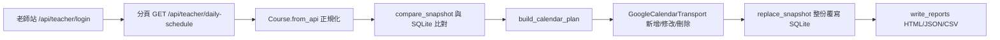
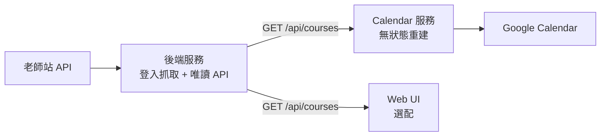

# course-robot 架構與介面設計（討論稿）

> **這是設計過程的紀錄，不是現況說明。** 專案最後的架構與用法請看 `README.md`。
> 文中保留當時的討論與被推翻的方案，用意是留下決策脈絡。

撰寫日期：2026-09-16（Asia/Taipei）
狀態：**設計討論稿，尚未修改任何程式**。
**2026-09-16 第二輪決策（現行定案）已寫入 §3.4**：刷新改為每天固定時段、**捨棄 SQLite 改為無狀態重建**、Calendar 獨立 compose 並改打後端唯讀 API（T2）。§3.2／§3.3／§4 的 checkpoint 與 schema 設計保留為演進紀錄，**不再實作**。
依據：本 repo 現有程式（`src/course_robot/`）、`README.md`、`DEPLOYMENT_PLAN.md`、`docs/report/index.html`、`docs/教師手冊/`（3 份 PDF＋14 張圖）、現有 `data/course-robot.db` 快照，以及 2026-09-16 對老師站公開前端 bundle 的唯讀觀察。

---

## 0. 摘要（先看這段）

**現行架構（第二輪定案，詳見 §3.4）**：後端服務只負責「登入老師站抓取 + 提供唯讀 API」，**不知道 Calendar 存在**；Calendar 服務獨立成另一個 compose，**沒有資料庫**，每輪呼叫後端 API、列舉日曆上的管理事件、比對後補寫；Web UI 未來打同一個 API。

1. **不再需要 SQLite**：event ID 由 `peak1<class_id>` 決定性產生，事件本身用 `extendedProperties` 自我標記，因此「哪個事件對應哪堂課」是**可重算的**，不需要對照表。
2. **不再需要 15 分鐘輪詢**：課程在開始前 24 小時內固定（已確認），改成**每天 00:00 一次**。已知缺口是「00:00 之後、當日第一堂課之前才成立的課」當天不會入曆，取捨見 §3.4。
3. **「過去的資料一定還在」是結構性保證**：刪除／修改只作用在 `start >= now` 的事件，已開始的一律不碰，所以程式再怎麼錯也動不到今天以前的紀錄。
4. **必須保留的安全機制**（無狀態之後仍然需要）：列舉視窗要比刪除視窗寬、異常筆數保護（取代原本的空快照保護）、INSERT/PATCH 恢復有界（§6.4）、輸入型別檢查。
5. **你擔心的 Windows→Linux 殘留問題，實際上不存在**：所有受版控文字檔皆為 LF、無 BOM、`bash -n` 與 `compileall` 全數通過、20 項測試全過（§1.4）。真正要修的是同步邏輯本身（§1.3 的 P0 清單，其中 P0-5 遞迴 bug、P0-2 分頁驗證仍然適用）。
6. **Google API 錯誤要分兩類處理**：`retryable`（429／5xx／網路）有限退避；`fatal`（401/403/404/400）立刻失敗並說清楚。真正的價值是「讓你知道」——目前 token 失效時 VPS 只會靜默失敗（§6.5）。
7. **Web 介面與 Calendar 共用同一個後端 API**（T2），所以介面不會被 Calendar 綁死——這正是你最初想要的解耦。

---

## 1. 現況盤點

### 1.1 目前資料流



模組責任切得很乾淨，`api.py`（抓取）、`models.py`（正規化）、`database.py`（狀態）、`google_calendar.py`（輸出）、`cli.py`（協調）邊界清楚。**這是好消息：要解耦並不需要重寫。**

### 1.2 已具備的正確設計（值得保留）

| 項目 | 位置 | 為什麼重要 |
|---|---|---|
| 以 `content_hash` 比對，而非直接比對欄位 | `models.py:109` | 相同資料第二次同步 = 0 次寫入，這正是你要的增量 |
| 穩定 Google event ID（`peak1` + sha256 前 32 碼） | `google_calendar.py:53` | 重試不重複建事件 |
| private extended property 標記管理事件 | `google_calendar.py:81` | 可掃描、可 reconcile、不誤刪別人的事件 |
| 全部 Calendar 操作成功後才替換快照 | `cli.py:162` | 中途失敗時 SQLite 不前進，下次可重試 |
| 空快照保護、重複 ID 拒絕 | `database.py:107`、`database.py:114` | 避免把 API 異常當成「全部取消」 |
| `verify_access` 只讀權限檢查 | `google_calendar.py:257` | 上線前可安全確認目標日曆 |

### 1.3 必須修正的問題（依嚴重度）

| # | 嚴重度 | 問題 | 證據 | 影響 |
|---|---|---|---|---|
| P0-1 | 高 | **課表更新與 Calendar 檢查點共用同一份資料**：`--no-calendar` 或 `GOOGLE_CALENDAR_ENABLED=false` 時，`apply_snapshot` 直接把快照推進，未推送的差異永久遺失（已用暫存 DB 重現：跑一次 `--no-calendar` 後，下一次 calendar plan 是 0/0/0，但日曆上仍是舊事件） | `cli.py:175`、`database.py:220`、`DEPLOYMENT_PLAN.md:49` | 除錯一次就漏同步一批課程，且無法從 SQLite 找回「已遺失的刪除」 |
| P0-2 | 高 | **分頁驗證不足**：`meta.total` 只在第一次讀到時採用，之後不再比對；`records[:reported_total]` 直接靜默截斷；第二頁空白即視為結束。`FetchResult.reported_total` 根本沒有被呼叫端讀取（`cli.py:125` 只用 `.pages`） | `api.py:109-117`；已重現 `total=2`、第 2 頁空 → 回傳 1 筆且不報錯 | 缺頁被當成「課程取消」→ 誤刪日曆事件；`README.md:152` 的保證目前不成立 |
| P0-3 | 高 | **刪除語意未驗證**：任何舊 ID 沒出現在新快照就刪日曆事件，但 API 是滾動時間窗 | `database.py:139-148`、`google_calendar.py:110-114`、`DEPLOYMENT_PLAN.md:50` | 課程自然過期＝誤刪；且已上完的課會從日曆消失（見 §6.3 實測數據） |
| P0-4 | 高 | **更換 Calendar 目標沒有防護**：SQLite 沒記錄事件是屬於哪個日曆。若只搬 DB 卻忘了改 `GOOGLE_CALENDAR_ID`（`.env.example` 預設 `primary`），下一次同步會拿舊 mapping 去 PATCH／DELETE **primary 日曆**裡的事件 | `config.py:43`、`database.py:18-38`、`google_calendar.py:136-149`、`DEPLOYMENT_PLAN.md:58` | 可能動到不該動的日曆 |
| P0-5 | 高 | **`insert_event` ↔ `patch_event` 無界遞迴**：POST 409（ID 被已取消的事件保留）→ PATCH 410（已刪除）→ POST 409 → …。已重現：約 498 次真實請求後 `RecursionError`；而 `RecursionError` 不在 `cli.py:282` 的捕捉清單內 → 直接 traceback 且狀態不前進，之後每輪都卡在同一筆 | `google_calendar.py:288-289`、`google_calendar.py:300-304`、`cli.py:282` | 同步永久卡死，需人工介入 |
| P0-6 | 中 | **沒有同步鎖**：worker 與手動 `sync` 可同時跑 | — | 兩邊同時 replace_snapshot 會產生重複/遺漏事件 |
| P0-7 | 中 | **沒有請求層重試**：429／可重試 5xx／網路錯誤直接等下一輪 | `api.py:50-58`、`google_calendar.py:241-255`、`DEPLOYMENT_PLAN.md:55` | 15 分鐘一輪，一次抖動就延後一輪 |
| P0-8 | 中 | **`calendar-plan` 名為預覽卻會建表與遷移 schema**：`connect()` 會**建立 DB 檔案**（已重現）並在每次連線執行 `DROP TABLE IF EXISTS` | `cli.py:234`、`database.py:36-37`、`database.py:88` | 預覽不該有副作用；也讓「資料庫不存在時的安全預覽」失效 |
| P0-9 | 中 | **健康檢查只看「抓取成功」，不看「Calendar 成功」** | `healthcheck.py:30` 讀 `sync_state.last_success_at` | Calendar 連續失敗 48 小時仍 healthy |
| P0-10 | 中 | **缺少結束時間時硬補 50 分鐘** | `google_calendar.py:59-63` | 手冊的正式課時是 25／50 分鐘，但實測 `end_time` 差值固定是 30／60 分鐘（0 筆缺漏），硬補 50 是憑空猜測（見 §8 待驗證 3） |
| P0-11 | 中 | **systemd 路徑無法運作**：`course-robot.service` 指定 `User=course-robot`，但全 repo 沒有任何建立該使用者的步驟 | `deploy/systemd/course-robot.service:8-9` | 第一次啟動即失敗（`Failed to determine user credentials`） |
| P0-12 | 中 | **`run-sync.sh` 不會同步 Calendar**：執行 `sync "$@"` 且未帶 `--calendar`，而 `.env.example` 的 `GOOGLE_CALENDAR_ENABLED=false` | `scripts/run-sync.sh:22`、`.env.example:8` | systemd 排程看起來成功，但日曆完全沒更新 |

### 1.4 已驗證為「健康」的部分（不必動）

為了避免過度修改，以下經實際檢查確認沒問題：

- **Windows 搬遷沒有殘留語法問題**：4 個 shell 腳本 `bash -n` 全數通過；所有受版控的文字檔 `git ls-files --eol` 皆為 `i/lf w/lf`（無 CRLF）、無 BOM；沒有任何 `C:\`、`AppData`、`.bat`、`.ps1`、`python.exe` 的實際引用（`README.md:79` 的 `C:\...` 只是警告文字）。`python -m compileall src tests` 通過。**你擔心的語法／換行問題，實際上已經乾淨。**
- 測試 **20 項全數通過**（`DEPLOYMENT_PLAN.md:82` 寫的「17 項」是舊數字）。
- 環境變數名稱在 `.env.example` / `config.py` / `compose.yaml` / `healthcheck.py` / entrypoint 之間**完全一致**，沒有死鍵（`SYNC_INTERVAL_SECONDS` 只對 Docker 路徑有效）。
- 冪等性成立：同一份資料跑第二次 → `plan.writes == 0`（已重現）。
- 現有 DB `quick_check=ok`、84 筆課程、84 個映射、`payload_json` 鍵集與 `Course` dataclass 完全一致、0 筆缺 `end_at`。
- Docker build context 沒有排除任何建置期需要的檔案（`pyproject.toml`、`uv.lock`、`README.md`、`src/`、`docker-entrypoint.sh` 都不在 `.dockerignore` 內）。

### 1.5 其他需要在實作時順手修掉的問題

| 嚴重度 | 問題 | 證據 |
|---|---|---|
| P1 | `models.py:84` 的 `students` 元素未做型別檢查（`knowledge_files` 有做），非物件元素會拋 `AttributeError`，而 `cli.py:282` 沒捕捉 → traceback | 已重現 |
| P1 | `database.py:97` `Course(**json.loads(...))` 在欄位不符時拋 `TypeError`（舊遷移會原樣搬 `payload_json`） | 已重現 |
| P1 | `google_calendar.py:196` refresh token 用 `write_text` 就地截斷覆寫，中途中斷會毀掉唯一的 refresh token | `DEPLOYMENT_PLAN.md:60` |
| P1 | `scripts/docker-entrypoint.sh:16-23` 只追蹤 `sleep` 的 PID；同步中收到 SIGTERM 會立刻 exit 0，進行中的同步在 45 秒後被 SIGKILL（可能在寫 Calendar 的中途） | `compose.yaml:41` |
| P1 | `compose.yaml:19-22` 沒有任何步驟預先建立／設定 `./data` 的擁有者；bind mount 來源不存在時由 Docker 以 `root:root` 建立，UID 10001 無法寫入 | 需在 VPS 步驟補 `install -d -o 10001 -g 10001 data` |
| P2 | `google_calendar.py:233-255` 的 `_request()` 是死碼；`google_calendar.py:110-114` 會為「從未同步過」的課程排入 DELETE（只靠 404 容忍才無害） | — |
| P2 | `scripts/run-sync.sh:19` 每輪 `>` 覆寫日誌（且 `--help` 也叫 sync，看不出差異）；`.gitattributes` 未涵蓋 `*.md`/`*.json`/`uv.lock`/`*.html` | 目前沒有 CRLF，屬預防性 |
| P2 | 檔案庫衛生：17 個 `*:Zone.Identifier`、`docs/tmp/review/deps/bin/*.exe`（Windows 執行檔）、過期的 `cpython-314` pyc；`DEPLOYMENT_PLAN.md:82` 引用的 anyio 4.15.1 其實來自 `docs/tmp`，`uv.lock` 是 4.14.2 | 建議整批刪除 `docs/tmp/` |
| P2 | `models.py:97` 的 `chapter` 預設 `"-"`，會產生「學生｜-」這種事件標題；`cli.py:41` 的 `--allow-empty` 說明與 `database.py:139-148` 的實際行為不一致 | — |


### 1.6 對老師站 API 的新發現（本次唯讀觀察）

從老師站公開的前端 bundle（`/assets/index-51bd1e4c.js` 及其 lazy chunk）可確認：

- `GET /api/teacher/daily-schedule` 的呼叫端會傳 `page`，以及可選的 `classTime`、`classType`、`grade`、`subject`、`search`；`classTime` 經 `dayjs(值).format("YYYY-MM-DD")` 後送出。→ **API 具備以日期區間縮小查詢範圍的能力**（實際接受格式需以登入後實測確認）。
- 回應每筆課程的欄位除了我們已在用的 `class_id`、`class_room_no`、`class_time`、`end_time`、`class_type`、`class_url`、`grade`、`level`、`subject`、`knowledge_point_title`、`version_name`、`students`、`knowledge_files` 之外，還有 **`status`、`status_label`、`pay_type`、`class_room_title`、`editable`、`is_read`、`test_level`、`last_all_code`、`last_knowledge_vercode`**。
- 其他可用端點（同一 bundle 內）：`/teacher/schedule`（放課時段，`listType=week` 用 `startDate`/`endDate`）、`/teacher/class-record`、`/teacher/classroom/{id}/info`、`/teacher/classroom/recordUrl`、`/teacher/classRating/*`。
- → 未來若想做「放課時段」或「課後評鑑進度」功能，這些端點已經存在，但都不該放進第一階段。

**對這些欄位的處置（2026-09-16 決策）**：

| 欄位 | 是否需要 | 理由 |
|---|---|---|
| `class_room_title` | **可選** | 目前 `class_room_no`（如 `R2026090400301`）是教室編號；`class_room_title` 應該是給人看的名稱（前端用它顯示「已預約的教室」）。UI 顯示較友善，但不影響同步正確性 |
| `status`／`status_label` | **不需要** | 已用實測確認：`daily-schedule` 只回傳已成立的課程（84/84 都有 `room_id`、`student_id`、教材）。**取消的課只會消失，不會留下帶狀態的列**，所以「消失判定」用觀測窗處理即可 |
| `pay_type` | **不需要** | 與「這堂課是否存在」無關 |
| `editable`／`is_read`／`test_level`／`last_*` | **不需要** | 屬於課後評鑑流程，不在本工具範圍 |

→ 結論：這些欄位**不進 P1**。若未來做 Web UI 想要更友善的教室名稱，再把 `class_room_title` 加進 `Course` 與公開 DTO 即可。

### 1.7 現有 SQLite 快照實測（重要）

```
現在時間：2026-09-16 00:31 +08:00
最後成功同步：2026-08-28T17:07:27+08:00（快照已過期 18.3 天）
課程筆數：84（全部 1v1、科目皆為數學），事件映射：84
課時分布：30 分鐘 × 75、60 分鐘 × 9；end_time 全部有值（0 筆缺漏）
章節跨距：2026-09-04 → 2026-09-27
其中「已經結束」的課：43 筆；「還沒開始」的課：41 筆（分布於 9/18、9/19、9/20、9/25、9/26、9/27）
```

這組數字直接推導出 §6.3 的首次上線風險。

---

## 2. 「增量」在新架構下的意義

第一輪時我把成本拆成「讀取／寫入 Calendar／狀態刷新」三項。第二輪改成無狀態重建後，**狀態刷新這一項整個消失**，剩下兩項的結論也更單純：

| 成本 | 現在的做法 | 說明 |
|---|---|---|
| **讀取**（login + 分頁 GET） | 每天兩次 | 一次 login + 1～2 次分頁 GET，一天約 4 次請求，成本可忽略 |
| **寫入 Calendar** | 只寫「內容有變」的事件 | 每輪列出日曆上今天之後的管理事件，用內容雜湊比對；**相同就完全不發出請求** |
| **刪除 Calendar** | 只刪「今天之後、日曆上有、但 API 沒回傳」的事件 | 過去的資料結構性不動（§3.4） |
| **狀態刷新** | — | **不再需要**：沒有資料庫、沒有快照、沒有檢查點 |

**結論**：在新架構下，「只動變動項」是**自動成立**的——因為沒有狀態要推進，每一輪就是「拿真實來源跟日曆對帳」，對得上的部分不會產生任何寫入。這比第一輪的 checkpoint 設計更簡單，而且更難出錯。

唯一的代價是每輪要多一次 `events.list`（幾十筆），這個成本遠低於維護一份狀態。

---

## 3. 架構選項與建議

### 3.1 三個選項

| 選項 | 形狀 | 優點 | 缺點 |
|---|---|---|---|
| **A. 現狀延伸** | 一個 worker，CLI 為主，未來網頁直接讀 `schedule.json` | 最省事 | 網頁被靜態檔綁死；不能查詢、不能篩選；每次都要等下一次 sync |
| **B. 分層單體（建議）** | 一個行程、一份 SQLite；內部分成「來源／狀態／輸出目標」三層；同時提供 CLI 與唯讀 HTTP API | 解耦效果 90% 達成；只有一份狀態、一套登入；Calendar、網頁、未來的通知都只是「輸出目標」之一 | 服務邊界在程式內而非網路上（但這正是重點） |
| **C. 真微服務** | `sync-api`（抓取＋狀態）＋`calendar-worker`＋`web-api` 三個容器，各自呼叫 API | 理論上可獨立擴縮 | 三份部署、三套認證、跨服務錯誤處理；狀態仍只有一份 DB，卻要多處理網路失敗；對單人專案是純負擔 |

### 3.2 建議：B，而且用「輸出目標（target）」抽象來解耦

```
                    ┌──────────────────────────────┐
   老師站 API ──────▶│  來源層 Source                │
   (唯一需要帳密的)   │  api.py / models.py          │
                    └──────────────┬───────────────┘
                                   │ 完整觀測集合 + 觀測時間窗
                    ┌──────────────▼───────────────┐
                    │  狀態層 State                 │
                    │  SQLite：課程快照 + 觀測窗     │
                    │        + 每個 target 的映射    │
                    └──────────────┬───────────────┘
                                   │ 每個 target 各自的 diff
        ┌──────────────────────────┼──────────────────────────┐
        ▼                          ▼                          ▼
┌───────────────┐        ┌──────────────────┐        ┌──────────────────┐
│ Target:        │        │ Target:          │        │ Target:          │
│ google_calendar│        │ read-only API    │        │ static JSON/CSV  │
│ (google_*.py)  │        │ (新，FastAPI/    │        │ (現有 report.py) │
│                │        │  stdlib)         │        │                  │
└───────────────┘        └──────────────────┘        └──────────────────┘
```

三個關鍵設計決定：

1. **登入老師站只發生在來源層，且只有一處。** 未來 Calendar 服務、網頁、通知都讀同一份狀態，不會各自去登入老師站（避免被鎖帳號、避免不一致）。
2. **每個 target 各自記錄「我推到哪個版本」。** 這解決 P0-1：`--no-calendar` 只推進「來源快照」與「static JSON」target，Calendar target 的檢查點不動，下次 `sync --calendar` 仍會看到那批差異並補推。
3. **target 是可加掛的。** 未來想加 Telegram 通知、Google Sheets 記錄、Notion 同步，都只是多一個 target 實作，不動核心。

### 3.2.1 你描述的「checkpoint / gateway」模型＝這個設計

你的理解正確，我把它寫成明確的責任分工：

| 角色 | 負責 | **不**負責 |
|---|---|---|
| **後端（fetch + store）** | 登入、抓取、驗證完整性（分頁 total／筆數／範圍）、把「目前觀測到的完整集合」寫進 SQLite、記錄觀測窗 | 不決定「要對 Calendar 做什麼」；不知道 Calendar 的存在 |
| **每個 checkpoint／gateway** | 讀取「目前的完整集合」＋自己的狀態；自己算出 diff（新增／修改／刪除）；自己決定要不要寫、怎麼寫；自己記住「我推到哪個版本」 | 不登入老師站；不碰別人的狀態；不修改來源快照 |
| **SQLite** | 保存來源快照＋觀測窗＋**每個 gateway 各自的狀態** | 不保存 gateway 的業務邏輯 |

三個推論：

- **加一個新 gateway（例如 Web UI、Telegram 通知、Google Sheets）不需要動爬蟲。** 爬蟲永遠只做「抓＋存」。
- **刪除日曆事件的邏輯屬於 Calendar gateway，不屬於後端。** 所以未來 Web gateway 想保留「已結束的課」、Calendar gateway 想刪「20 小時外的課」，兩者可以有不同的策略，不會互相干擾。
- **一個 gateway 壞掉，其他 gateway 照常運作。** 失敗只會讓它自己的 checkpoint 不前進，下次重跑會補上。
- **共同邏輯仍可共用程式碼**（例如 diff 演算法放模組裡被多個 gateway 呼叫）——「解耦」指的是**狀態與決策分離**，不是把同一段程式碼複製三份。

### 3.4 【2026-09-16 第二輪決策】無狀態 Calendar 服務（取代 §3.2 的 checkpoint 設計）

第二輪討論推翻了「每輪全量抓取 + 增量推送 + SQLite 檢查點」的路線，改成**無狀態的每日重建**。這一節是**現行定案**，§3.2／§3.2.1 保留作為演進紀錄。

#### 三個決策

| # | 決策 | 影響 |
|---|---|---|
| 1 | **刷新頻率改為每天 00:00 一次** | 因為「課程在開始前 24 小時內固定」，高頻輪詢沒有必要 |
| 2 | **捨棄 SQLite**，改為「列舉日曆上的管理事件 → 比對 → 補寫」 | 不再需要事件對照表、schema 遷移、同步鎖、DB 權限 |
| 3 | **Calendar 獨立成另一個 compose**，資料來源改為呼叫後端唯讀 API（T2） | 兩個服務沒有共用檔案或資料庫，各自獨立部署與重啟 |

#### 新的架構



- **後端服務**（獨立的 compose）：唯一持有老師站帳密；定時抓取並在記憶體中保留目前窗口；提供唯讀 JSON API。它**不知道 Google Calendar 存在**。
- **Calendar 服務**（另一個 compose）：定時被觸發 → 呼叫後端 API 取得窗口 → 列舉日曆上帶管理標記的事件 → 比對 → 新增／修改／刪除。**沒有資料庫**，唯一保存的檔案是 OAuth token。
- **Web UI**（未來）：呼叫同一個後端 API。這正是你最初「介面不被 Calendar 綁死」的目標。

#### Calendar 服務的執行流程（每輪）

```
1. GET 後端 /api/courses            → 取得窗口內課程（含 window_start / window_end）
2. 安全檢查：筆數是否異常偏少？      → 是則整輪中止，不執行任何刪除
3. events.list(timeMin = 今天 00:00, privateExtendedProperty = course_robot_managed=true)
4. 對每筆課程：event id = peak1<class_id>（純英數，無連字號）
     - 日曆上已有 → 內容雜湊不同才 PATCH（相同則完全跳過）
     - 日曆上沒有 → INSERT
5. 對日曆上「有管理標記、但課程清單裡沒有」的事件：
     - start >= now（還沒開始）→ 刪除
     - start < now（已開始或已結束）→ 一律不碰
6. 寫一行執行摘要（時間、新增/修改/刪除數、錯誤）
```

**「過去的資料一定還在」是結構性保證，不是靠判斷**：第 5 步的刪除條件是 `start >= now`，所以任何已經開始的事件都不可能進入刪除清單，程式再怎麼錯也刪不到。

> **為什麼刪除條件用 `now` 而不是「今天 00:00」**：你選的是「只處理今天之後的事件」，而 `start >= now` 是它的嚴格版本——它同樣只處理今天之後，但**額外保護了「今天已經開始上課」的那些事件**。這樣「今天 10:00 的課已上完、13:00 才被取消」的情況，事件不會被刪掉，符合你要的「前面的資料還在」。

#### 三個必須保留的保護（無狀態之後仍然需要）

| 保護 | 為什麼需要 | 沒有它會怎樣 |
|---|---|---|
| **列舉視窗要比刪除視窗寬**：`timeMin = 今天 00:00`，但刪除／修改只針對 `start >= now` 的事件 | 「今天早上已開始的課被取消」的事件，其 `start` 在今天，若不列舉出來就永遠不會被處理 | 幽靈事件永遠留著 |
| **異常筆數保護**（第 2 步） | 無狀態之後就沒有「上一份快照」可以比對，空快照保護必須換成「筆數合理性檢查」 | 後端迴圈壞掉回傳 0 筆時，會把今天之後的日曆全部刪光 |
| **恢復有界**（§6.4） | INSERT 遇到 409（ID 被已刪除的事件保留）→ PATCH → 410 → 再 INSERT 的無限迴圈 | 那一筆永遠失敗，且會讓整輪卡住 |

#### 「消失的課」要怎麼處理（含臨時請假）

先講一個容易混淆的地方：**「課程本身」和「實際上課狀況」是兩件事。**

- **課程本身**：在開始前 24 小時就鎖定，不會被改、也不會被取消 → 所以正常情況下，一堂鎖定過的課**不會從 API 消失**。
- **實際上課狀況**：學生臨時請假、no show 這些，屬於課後／課堂事件，平台的課表不一定會反映。

因此 Calendar 服務看到的「消失」，只可能來自三種原因：

| 原因 | 發生時機 | 應該怎麼處理 |
|---|---|---|
| 課在鎖定前被取消 | `start > now + 24h` | **刪除事件**（這是正常的取消） |
| 課已經開始後才從來源消失（例如輔導老師事後取消） | `start <= now` | 依你的決策：**保留事件**，不刪 |
| API 窗口滑動導致舊課掉出窗外 | 通常是 `start < now` | 保留（同上） |

**決策：不做任何記錄（維持原本的不做）。** 現行設計就是靜靜把事件留在日曆上；事件說明已含「支點課程 ID」，事後可回老師站查證。**不寫 log、不改事件狀態、不碰過去的事件。**

#### 刷新時段：每天 00:00 一次（已定案）

**前提（已確認的平台事實）：課程在開始前 24 小時內固定，不會被臨時修改。** 因此一天一次的原則上足夠：

```
00:00 執行 → 取得「今天 + 未來約一個月」的完整窗口
```

為什麼 00:00 這個時點是安全的（以一堂「明天 14:00」的課為例）：

| 時點 | 這堂課的狀態 |
|---|---|
| 今天 00:00（本次執行） | 已成立的話就會被抓到；就算還沒成立，它也必須在**今天 14:00 之前**成立（＝開課前 24 小時） |
| 今天 14:00 | 進入鎖定，之後不再變動 |
| 明天 00:00（下次執行） | 一定抓得到（已鎖定），距離上課還有 14 小時 |
| 明天 14:00 | 上課 |

也就是說：**這堂課最晚會在「上課前 14 小時」被寫進日曆**，而且內容已經是最終版本。今天的課則因為在 00:00 時早已鎖定，抓到的就是最終版本。

**唯一的缺口**：如果有一堂課是在「00:00 之後、且距離開課不到 24 小時」才成立（違反「最晚 24 小時前預約」的規則），那它要等到隔天 00:00 才會入曆，而那時課已經上完了。

若平台的規則確實成立，這個缺口不會發生；真有特殊情況會由人工向平台反映處理，**程式不做額外偵測或補償**。

**窗口大小**：由現有快照實測，最後一次成功抓取（2026-08-28 17:07）回傳的課程最遠到 **2026-09-27**，也就是**至少往後 30 天**。一次抓取就涵蓋未來一整個月，P1 實測時要確認這個上界。

#### 這個架構放棄了什麼

| 放棄的能力 | 影響 | 是否需要補救 |
|---|---|---|
| 「已推送到哪個版本」的檢查點 | 每輪都要重新列舉日曆（幾十筆，成本可忽略）；內容相同時靠雜湊比對跳過寫入 | 不需要 |
| 來源快照 | 無法回答「這堂課上週是不是存在」 | 不需要（你只在乎今天之後） |
| 歷史異動紀錄 | 無法回溯「這堂課什麼時候被改的」 | 用每輪的執行摘要（第 6 步）部分補足 |
| Web UI 直接讀 DB | Web 必須改讀後端 API | 這正是 T2 的目的 |

---

## 4. 資料模型設計（**已被 §3.4 取代，僅保留為演進紀錄**）

> 第二輪決策已捨棄 SQLite。以下 schema 與增量演算法**不再實作**；保留原因是「如果未來又需要狀態」時可以回頭參考，以及說明當初為什麼需要它。現行設計請看 §3.4。

### 4.1 現況問題

`courses` 表同時裝了四種不同語意的東西（`database.py:19`）：

| 欄位 | 真正語意 | 問題 |
|---|---|---|
| `source_id`, `payload_json`, `content_hash`, `start_at` | 來源快照 | 合理 |
| `synced_at` | 不明確 | 是「抓到」還是「推送成功」？ |
| `google_event_id` | **某個 target 的推送結果** | 與 Calendar 綁死；無法表達「這筆已推送給誰、推到哪個版本」 |
| `sync_state.last_success_at` | 不明確 | 是抓取成功，還是 Calendar 成功？ |

### 4.2 建議 schema

```sql
-- 1) 來源快照：老師站最後一次觀測到的樣子（單一真相）
CREATE TABLE courses (
    source_id     TEXT PRIMARY KEY,
    payload_json  TEXT NOT NULL,
    content_hash  TEXT NOT NULL,
    start_at      TEXT NOT NULL,          -- ISO8601 +08:00，供查詢排序
    end_at        TEXT NOT NULL DEFAULT '',
    first_seen_at TEXT NOT NULL,
    last_seen_at  TEXT NOT NULL
);
CREATE INDEX courses_start_idx ON courses(start_at);

-- 2) 觀測窗：分辨「取消」與「自然過期」的關鍵
CREATE TABLE observation_windows (
    id            INTEGER PRIMARY KEY CHECK (id = 1),
    fetched_at    TEXT NOT NULL,
    window_start  TEXT NOT NULL,   -- 本次 API 實際回傳的最早 class_time
    window_end    TEXT NOT NULL,   -- 本次 API 實際回傳的最晚 class_time
    reported_total INTEGER NOT NULL,
    fetched_count  INTEGER NOT NULL
);

-- 3) 輸出目標與其檢查點
CREATE TABLE targets (
    target      TEXT PRIMARY KEY,        -- 'calendar:<calendar_id>', 'web', 'csv'
    synced_at   TEXT,                    -- 最後一次「完全成功」的推送時間
    state_json  TEXT NOT NULL DEFAULT '{}'  -- 例：{"calendar_id_hash":"…"}
);

CREATE TABLE target_items (
    target        TEXT NOT NULL,
    source_id     TEXT NOT NULL,
    remote_id     TEXT NOT NULL DEFAULT '',
    applied_hash  TEXT NOT NULL,         -- 已推送到該 target 的內容版本
    applied_at    TEXT NOT NULL,
    PRIMARY KEY (target, source_id)
);

-- 4) 每輪摘要（人看的、可選）
CREATE TABLE sync_runs (
    id INTEGER PRIMARY KEY AUTOINCREMENT,
    started_at TEXT NOT NULL, finished_at TEXT,
    target TEXT NOT NULL,
    created INTEGER NOT NULL DEFAULT 0,
    updated INTEGER NOT NULL DEFAULT 0,
    removed INTEGER NOT NULL DEFAULT 0,
    unchanged INTEGER NOT NULL DEFAULT 0,
    error TEXT NOT NULL DEFAULT ''
);
```

**`target` 的 key 要把 `calendar_id` 綁進去**（例如 `calendar:<sha256(calendar_id)[:12]>`），這樣 P0-4 就自然解決：換日曆＝換 target＝舊映射不會被誤用，且舊 target 的紀錄留著可稽核。

### 4.3 增量演算法（每輪）

> **2026-09-16 決策更新**：你確認了兩件事——(1) **課程在開始前 24 小時內不會再被改動**，因此判定用的固定窗取 **20 小時**；(2) 你的排課時段是 **14:00–22:00**，此時段以外不會有課程被取消。以下演算法已依此調整。

```
fetch:  取得本次完整觀測集合 C（含 window_start / window_end）
        驗證：分頁 total 一致、實際筆數相符、page 不超界；不符 → 整輪中止，不動任何狀態
        已知事實：daily-schedule 只回傳「已成立」的課程（84/84 都有 room_id、student_id、教材）
                  → 取消的課只會「消失」，不會以帶狀態的列出現

state:  對 c ∈ C：
          hash(c) 與 DB 相同 → untouched（唯一會被「跳過」的一群）
          不存在            → added
          hash 不同          → updated
        對 DB 有、C 沒有的 s，判定為「已移除」需同時成立：
          (a) s.start_at > now + 20h   ← 24 小時內凍結，20 小時留 4 小時安全邊際
          (b) s.start_at 落在「已成功觀測過」的日期／時間範圍內
              （沒被觀測到的區間，無從推論，一律不刪）
          (c) s.start_at 落在 14:00–22:00  ← 你實際排課的時段
          其餘一律標記為 aged_out / out_of_scope：只寫稽核紀錄，不刪任何 target 項目

target: 對每個已啟用的 target（＝一個 gateway／checkpoint）：
          plan = 該 target 尚未套用當前 hash 的 added ∪ updated ∪ removed
          依序套用 → 成功才寫該 target 的 target_items
          任一項失敗 → 記錄 sync_runs.error，該 target 的檢查點不前進（其他 target 不受影響）

commit: 以差異式 upsert 更新 courses（不整表刪除）
        更新 observation_windows
```

**為什麼 (a) 用 20 小時而不是「未來」**：24 小時內課程凍結，所以「快開始了才消失」在正常情況下不該發生；20 小時留 4 小時緩衝，避免因為時鐘誤差或平台提前鎖定而誤判。反過來說，**超過 20 小時才消失的課，是真的被取消或改期**（可能已改排到別的時段，會以新 `class_id` 重新出現）。

**為什麼「已結束的課」自然不會被刪**：`start_at` 已過 → 不滿足 (a) → 判定為 aged_out。這正好符合你的選擇「結束就結束，保留日曆紀錄」。

**為什麼 (b) 需要「已觀測區間」**：API 只回傳一段滾動窗。課程自然流出窗外時也會消失，那不是取消。做法不需要猜平台的窗有多大——只要記錄每次成功抓取到的 `min/max start_at`，並針對每一筆候選課程確認「它的時間點曾被涵蓋在至少一次成功觀測內」即可。

**為什麼 (c) 要加上排課時段**：你只在 14:00–22:00 排課，此時段外的課程本來就不該存在於你的課表。把它排除在刪除判定外，等於多一層保險；若真的出現時段外的課，會落到 aged_out 並留下紀錄供你查看。

### 4.3.1 （已作廢）時段感知的 15 分鐘輪詢

第二輪已改為每天 00:00 一次，見 §3.4。此處保留原始推論：當時假設需要高頻輪詢才能在課程被改動的當下捕捉到，但既然「24 小時內固定」已確認，高頻就沒有必要了。


**為什麼這樣就滿足「只動變動項」**：untouched 的課程不會出現在任何 target 的 plan 裡，也不會被寫入資料庫。第二次執行同一份資料 → `created=0, updated=0, removed=0`，這可以寫成回歸測試。

**為什麼「移除」需要 (a)+(b)+(c)**：手冊明訂「學生取消課程不等於老師時段取消（會繼續媒合其他學生）」，課程會自然過期，也可能換學生後以新 `class_id` 重新出現。三條件分別對應「冷卻期」「觀測證據」「你的實際排課範圍」。

### 4.4 Calendar 事件的語意（依手冊校正）

| 手冊規則 | 設計對應 |
|---|---|
| 後台「我的課表」為準；Email 可能延遲、排課期間通知暫停 | 唯一來源是 API；不解析 Gmail（已符合） |
| 最晚 24 小時前才預約（24 小時前會直接預約） | 新課最晚在開課前 24 小時成立 → 每天 00:00 的執行已涵蓋；「昨天沒有這堂課」是正常現象 |
| 連堂＝同一學生連續兩／三堂，只需進第一間教室，中間不休息 | 目前資料是每堂一筆獨立 `class_id`（例如 20:00–20:30、20:30–21:00）→ **維持一堂一事件**；在事件說明加註連堂提示 |
| 25／50 分鐘為正式課時單位；連堂兩堂＝50 分鐘、三堂＝75 分鐘 | 事件的 `end` 必須來自 `end_time`；缺值時**不要猜**，改為跳過並記錄（見 §10 待驗證 3）。注意手冊的「25／50」與實測 `end_time` 差值「30／60」不一致，需先釐清語意再決定是否調整 |
| 教材有出入以雲端為準，教室內可能是舊版 | 教材／解答 URL 變更必須觸發事件更新（目前 URL 在 `content_hash` 內，已符合） |
| 課前 40 分鐘課表反黃、點擊進教室 | 網頁 UI 的「即將上課」狀態閾值用 40 分鐘（§7） |
| 課程不得提早下課、需滿 25 分鐘 | 不需寫入 Calendar；但**事件長度要與課時一致**，不要用預設值灌水 |

事件內容建議（沿用現行格式，僅補充）：

```
summary:     學生｜章節
description: 年級 / 教材 URL / 解答 URL / 教室 URL / 支點課程 ID
             ＋（新增）課時：30 分鐘；連堂：本日第 1 堂，請進第一間教室
visibility:  private
extendedProperties.private:
             course_robot_managed=true
             course_robot_source_id=<class_id>
             course_robot_target=<target key>   ← 新增，方便掃描與 reconcile
```

---

### 4.5 Event ID 的產生方式（2026-09-16 新增討論）

現行做法是 `google_event_id(source_id)`＝`peak1` ＋ sha256 前 32 碼（`google_calendar.py:53`），把任意長度、任意字元的來源 ID 映射到 Calendar 允許的字元集。

**實測資料**：`class_id` 全部是 **6 位純數字**（544897～559701），84/84 都符合 Calendar 的 `^[0-9a-v]{5,1024}$` 規則（允許 `a-v`、`0-9`、`-`、`_`、`.`；長度 5–1024）。**所以直接用 `class_id` 當 event ID 在技術上完全可行。**

| 面向 | hash（現行） | 直接用 `class_id` | 加前綴 `peak1<class_id>`（無連字號） |
|---|---|---|---|
| 可讀性／可追溯 | 差：`peak1365d10eb…` 完全看不出是哪堂課 | 好：ID 就是課程 ID，能直接對回老師站 | 好，且看得出是哪個工具建的 |
| 除錯 | 要反查 DB | 日曆 URL、日誌、API 錯誤訊息都能直接讀 | 同左 |
| 揭露的資訊 | 無 | 連續遞增的內部 ID → 從 ID 差異可推估平台課程量與成長 | 同左（但日曆目前是 private） |
| 與其他工具碰撞 | 無 | 低（日曆內沒有別人） | 無 |
| 未來接第二個來源 | 免處理（hash 本身就含來源 ID） | **會撞號** | 需再改前綴 |
| 來源改 ID 規則／換平台 | 只要 `source_id` 不變就沒事 | 若平台回收或重用 ID，事件會指向錯的課 | 同左 |
| 長度保證 | 固定 37 字元 | 需自行驗證（目前 6 字元，遠低於 1024 上限） | 需自行驗證 |

**實際測試結果（2026-09-16，真實 Calendar API）**：

| 候選 ID | 結果 |
|---|---|
| `558798` | ✅ 接受 |
| `peak1558798` | ✅ 接受 |
| `peak1abcde` | ✅ 接受 |
| `r558798`、`a558798` | ✅ 接受 |
| **`peak1-558798`** | ❌ **400 Invalid resource id value** |
| `558798-peak1`、`course-robot-558798` | ❌ 同上 |

→ **連字號 `-` 不被接受**，只有英數字可以。原本程式的 `google_event_id()` 回傳值雖然帶前綴，但因為是 `peak1` + 十六進位字串、全程無連字號，所以才一直正常運作。

**最終決定：`peak1<class_id>`**（無連字號），例如 `peak1558798`。

- 保留 `peak1` 前綴 → 命名空間仍在，未來接第二個來源不會撞號
- 可讀性：能一眼看出是 `course-robot` 建立的，且尾段就是課程 ID
- 格式驗證：`^[0-9a-v]{5,1024}$`（**不含任何標點**）；不符則 fallback 回 hash
- 碰撞恢復時，後綴用 **`r1`、`r2`**（`peak1558798r1`），不可用 `-r1`

> 註：拿掉 hash 並不會少一層安全——hash 從來不是為了保密（`class_id` 不是機密，且 sha256 沒有加鹽），它只是「把任意字串塞進受限字元集並固定長度」的編碼手段。前綴才是真正的命名空間。

---

## 5. 讀取策略

> 第二輪決策後，這一節的結論大幅簡化：**改成每天固定時段刷新**（§3.4），所以「如何降低每輪讀取量」不再是問題。以下保留為背景與未來優化參考。

### 5.1 為什麼「每天兩次」就夠

因為課程在開始前 24 小時內固定（已確認），所以：
- 既有的課不會臨時變動 → 不需要為了它提高頻率。
- 唯一會變的是「新排入的課」，而那發生在開課前 24 小時以前 → 每天 00:00 一次即可涵蓋，唯獨「當天稍晚才成立的課」會延後一天入曆（§3.4）。

### 5.2 仍然值得實測的兩件事

1. **條件式請求**：若 API 回 `ETag` / `Last-Modified`，後端服務可以用它避免重複處理。效益有限（一天才兩次），但有就順手用。
2. **日期區間參數**（`classTime`／`start_date`／`end_date`）：這對**後端 API 的查詢介面**更有價值——Web UI 就能查「下週」「某一天」，而不是只能拿整包。

### 5.3 分頁完整性仍然是必須的

即使一天只跑兩次，「缺頁被當成課程取消」的風險不變：後端 API 若回傳不完整的清單，Calendar 服務會把日曆上今天之後的事件刪掉。所以：

- 分頁驗證（`meta.total` 一致、實際筆數相符）**是 P1 的必做項**。
- **異常筆數保護**（§3.4 第 2 步）是 Calendar 服務的第二道防線。

---

## 6. 上線與帳號切換

### 6.1 換 Google 帳號／Calendar ID／token 的正確順序

你目前 `.env` 的 `GOOGLE_CALENDAR_ID` 指向舊帳號的日曆，`data/google-token.json` 的 refresh token 也已失效（token 檔內 `account` 欄位為空、`expiry` 停在 2026-08-28）。建議流程：

```
1. 沿用同一個 Google Cloud 專案（網域已驗證、OAuth 品牌已填、static pages 已在 Cloudflare）
   → 把 OAuth 同意畫面重新設回 In production（內容都是現成的，複製貼上即可）
   → credentials.json（Desktop app client）不必更換
2. 用「新的 Google 帳號」登入並執行 course-robot calendar-auth
   → 產生新的 data/google-token.json（目前這份的 refresh token 已失效，必須重做）
3. 在新帳號建立（或指定）「支點課程」日曆，取得新的 Calendar ID
4. 舊日曆停用（不要刪除），保留作為歷史紀錄
5. calendar-check        # 唯讀確認 token 對新日曆有寫入權限
6. calendar-plan         # 列出預計新增／修改／刪除，不寫入任何資料
7. calendar-sync         # 正式執行（無狀態重建，見 §3.4）
```

**切換帳號的兩個安全前提**（避免動到不該動的東西）：

- **舊日曆原封不動停用，不要刪除**：這樣即使程式有 bug，也不會傷到既有資料；新日曆從零開始。
- **`.env` 的 `GOOGLE_CALENDAR_ID` 一定要填好再跑**：`.env.example` 的預設值是 `primary`（`config.py:43`），若忘了改，程式會在**你主日曆**上建立課程事件。建議加一道啟動檢查（見 §6.3 最後一段）。

### 6.2 為什麼不要保留舊映射直接同步

`apply_calendar_plan` 會用 `existing_event_ids.get(source_id) or google_event_id(source_id)`（`google_calendar.py:136`）。舊映射若指向**舊日曆的 event id**，在新日曆上並不存在 → PATCH 會 404 → 觸發 `insert_event`（`google_calendar.py:300`）→ 用穩定 ID 插入。結果看起來會成功，但每一次都是「先失敗再補救」，而且一旦新日曆剛好存在同 ID 事件就會變成覆寫。**重置映射讓第一次是乾淨的 INSERT，行為可預期。**

### 6.3 首次上線：從最新的地方開始（已拍板）

**第二輪架構下這件事變得非常簡單**：Calendar 服務是無狀態的，只處理「今天之後」的事件，所以「舊快照過期 18 天、43 堂已結束」這個問題**自然消失**——那些課都在今天以前，不在處理範圍內。

第一次上線流程：

```
1. 舊日曆停用（不要刪除），保留作為歷史紀錄
2. 在新的 Google 帳號建立「支點課程」日曆，取得新的 Calendar ID
3. 重設 OAuth 為 In production，用新帳號執行 calendar-auth
4. 設定 .env：新的 GOOGLE_CALENDAR_ID 與 token
5. calendar-check                 # 唯讀確認 token 對新日曆有寫入權限
6. 先做一次 dry-run（只列出計畫，不寫入）
7. 正式執行第一次重建 → 對空日曆建立今天之後的全部事件
8. 立刻再跑一次 → 應為 0 次寫入（驗證冪等性）
```

**不需要**：資料庫、bootstrap 旗標、事件映射重置。因為沒有狀態可以過期，也沒有舊映射可以誤用——`peak1<class_id>` 是由當次抓到的課程即時算出來的。

**唯一要小心的**：第一次執行前確認 `GOOGLE_CALENDAR_ID` 是**新日曆**，別讓它指向你正在用的主日曆（`.env.example` 的預設值是 `primary`）。這是唯一可能「寫錯地方」的路徑，建議在程式啟動時加一道檢查：拒絕在 `primary` 上執行刪除（可寫入、但刪除需要明示 `--allow-primary`）。

### 6.4 P0-5 遞迴 bug 白話解釋（你問的那一項）

#### 涉及的兩段程式碼

```python
# google_calendar.py:281
def insert_event(self, event_id, body):
    response = POST .../events  {..., "id": event_id}
    if response.status_code == 409:        # ← ID 已被佔用
        return self.patch_event(event_id, body)   # 改成「更新」
    ...

# google_calendar.py:294
def patch_event(self, event_id, body):
    response = PATCH .../events/{event_id}
    if response.status_code in (404, 410):  # ← 事件不存在
        return self.insert_event(google_event_id(source_id), body)  # 改成「新增」
    ...
```

#### 什麼情況會出事

這兩個「補救」會互相觸發。實際會遇到的場景：**日曆上的事件被刪掉，但本機的映射還在**。例如：

- 你手動在 Google Calendar 刪掉某堂課的事件；
- 更換日曆／重建日曆後，本機還留著舊的事件 ID（就是本次換帳號的情境）；
- 事件被 Google 端清掉（例如使用者撤銷授權後重建）。

流程會變成：

```
POST   id=peak1abc…  → 409（Google 對「已刪除的事件 ID」會保留一段時間，不准重用）
   └─ PATCH id=peak1abc…  → 410（該事件已被刪除，不存在）
        └─ POST id=peak1abc…  → 409（同一個 ID，當然還是衝突）
             └─ PATCH id=peak1abc…  → 410
                  └─ …（無限循環）
```

因為它是**函式互相呼叫**，Python 的遞迴深度（預設 1000）用盡後拋出 `RecursionError`。已實測：約 996 次呼叫（≈498 次真實 API 請求）後爆掉。以 Google 的速率限制來看，這已經足以讓日曆 API 對你短暫限流。

#### 為什麼後果特別嚴重

`RecursionError` 不是 `RuntimeError` 的子類，也不在 `cli.py:282` 的捕捉清單內：

```python
except (GoogleCalendarError, Peak1ApiError, ValueError, OSError) as exc:
```

所以它會直接往上拋成 traceback，而且因為 `replace_snapshot` 在 `apply_calendar_plan` 之後（`cli.py:162-167`），**這一輪的檢查點不會前進**。下一輪重跑會再遇到同一個壞掉的 ID，再次爆掉——**同步永久卡死，而且錯誤訊息只是一個 traceback，看不出真正原因**。

#### 修法（簡單且不會再發）

1. **只允許一次補救**：把 `insert_event` / `patch_event` 改成「嘗試 → 失敗則回報」，恢復動作由呼叫端做一次，不再互相呼叫。
2. **第二次仍失敗就換一個新 ID**：例如 `peak1<hash>-r1`、`-r2`（Calendar 的事件 ID 允許 `a-v` 與 `0-9`），並把新 ID 寫回映射。這樣「已被刪除的 ID 被保留」也不會卡住。
3. **把 `RecursionError` 加進捕捉清單**（`cli.py:282`），至少讓它變成可讀的錯誤而不是 traceback。
4. **刪除時一併清掉本機映射**（目前 `delete_event` 對 404/410 是靜默通過，映射卻被保留），這樣「本機說有、日曆上沒有」的落差會自然收斂。

#### 驗收測試

用 `httpx.MockTransport` 模擬「POST 永遠 409、PATCH 永遠 410」，斷言：呼叫次數有上限、最終拋出 `GoogleCalendarError`、且第二次執行會改用新 ID 成功建立事件。

#### 為什麼這個 bug 跟「event ID 用 hash 還是 class_id」無關

409 的成因是**日曆上那個 ID 被 tombstone（已刪除但保留）佔用**，與 ID 怎麼產生無關。改成 raw `class_id` 一樣會卡在同一個循環裡。兩者是獨立議題，見 §4.5。

### 6.5 Google API 錯誤分類：哪些要處理、哪些不要

問題：「為什麼要處理 Google 回傳的錯誤？具體什麼情況會回錯？」

先講**目前程式的實際行為**：只有兩個地方會拋錯（`insert_event`／`patch_event` 非 200、`delete_event` 非 204/404/410），其餘一律往上拋成 `GoogleCalendarError`；而 `cli.py:282` 只捕捉 `GoogleCalendarError, Peak1ApiError, ValueError, OSError` → 其他例外（例如 `httpx.ConnectError`、`RecursionError`）直接 traceback。而且**任何一個事件失敗就整輪中止**，不會繼續處理其餘 83 筆。

#### A. 一定會遇到（就算程式寫得完美）

| 情境 | Google 回什麼 | 目前行為 | 應該怎麼做 |
|---|---|---|---|
| access token 過期（約 1 小時） | 程式會先自動 refresh；**refresh 本身失敗**時 token endpoint 回 `400 invalid_grant`，google-auth 拋 `RefreshError` | 已捕捉，提示重跑 `calendar-auth` ✅ | 保留 |
| refresh token 失效 — Testing 狀態 7 天到期、手動撤銷授權、改密碼、或超過 50 個 refresh token 上限 | 同上 | 同上 | 保留，並讓**健康檢查**反映出來（否則 VPS 會靜默停止同步） |
| 換帳號／日曆後 token 與目標不符 | 同上 | 同上 | 這正是你現在的處境 |

> 這一類「遲早會發生」，而且**發生時你不會收到通知**——目前 `docker-entrypoint.sh` 只把錯誤寫進 log，然後等 15 分鐘再試一次。這才是錯誤處理真正的價值：不是防止錯誤，是**讓你知道**。

#### B. 設定錯誤（第一次部署就會遇到，而且重試永遠不會成功）

| 情境 | Google 回什麼 | 應該怎麼做 |
|---|---|---|
| `GOOGLE_CALENDAR_ID` 填錯／日曆不存在 | `404 notFound` | **不重試**，直接失敗並講清楚是哪個 ID |
| Calendar ID 正確但你沒有寫入權限（別人的日曆、或只有 reader） | `403 forbidden` | 不重試，提示檢查權限 |
| 日曆屬於另一個 Google 帳號（換帳號時最常見） | `404` 或 `403` | 不重試，提示 token 與日曆不匹配 |
| 事件內容不合法（時區名稱錯、`end <= start`、`summary` 過長） | `400 badRequest` | 不重試，這是我們的 bug，要讓它明顯 |

> 這類若被當成「暫時性錯誤」重試，只會每 15 分鐘失敗一次、log 一直長，問題卻永遠不會自己好。

#### C. 暫時性錯誤（Google 官方明確建議重試）

| 情境 | Google 回什麼 | 應該怎麼做 |
|---|---|---|
| 短時間內請求過多 | `403` + reason `rateLimitExceeded`（少數情況 `429`） | 指數退避重試 3～5 次 |
| Google 端暫時故障 | `500` / `503`（`backendError`） | 同上 |
| VPS 對外網路抖動、DNS、TLS 中斷 | `httpx.ConnectError` / `ReadTimeout` 等 | 同上（這是**目前完全沒捕捉**的一類） |

> 你的情境其實**不容易撞到限流**：一天約 96 輪，但每輪只有**變動的**課程才寫入，所以實際每天通常只有個位數到數十次請求。唯一可能撞到的是「第一次 bootstrap 一次建立 84 個事件」，而那也是唯一真正需要退避的場景。
>
> 原則是**重試有上限**（例如 3 次、間隔 1s／2s／4s），不要無窮重試。

#### D. 語意衝突（唯一會無限迴圈的一類）

| 情境 | Google 回什麼 | 目前行為 |
|---|---|---|
| 本地 mapping 指向的事件已被刪除 | PATCH → `404`／`410` | 改 insert（合理的補救） |
| 用一個「曾存在但已刪除」的 ID 建立事件 | POST → `409`（**已刪除的 ID 會被保留；`GET` 它會回傳 `status: "cancelled"`**。官方 [events.insert](https://developers.google.com/calendar/v3/reference/events/insert) 也說明：由於系統分散，不保證 ID 衝突會在建立時就被偵測到） | 又改 PATCH → `410` → 再 insert → 無限迴圈（§6.4） |
| 刪除一個已經不存在的事件 | `404`／`410` | 靜默容忍（正確，但**本機 mapping 沒被清掉**，見 §6.4 修法 4） |

> 我們用 `class_id` 產生 ID，而 `class_id` 不會被重用，所以**這一類正常情況下不會發生**——只在「事件被刪除但本機 mapping 還在」時出現（手動刪事件、換日曆）。修法是讓恢復有界（§6.4），不是取消恢復。

#### 不需要處理的部分（避免過度設計）

- **每日全域配額**（1,000,000 queries/day）：量級差距太大。
- **事件 ID 碰撞**：日曆私有、ID 由我們產生，實務上不會發生。
- **`410` 代表「已刪除且不再回來」**：不需要嘗試等它回來。

#### 對應到程式的最小改動

1. 分兩類：`retryable`（429／5xx／網路錯誤）用有限退避；`fatal`（401/403/404/400）立刻失敗並說清楚原因。
2. **單筆失敗不要中止整輪**：記為 pending、繼續處理其餘課程，最後把成功的部分寫回檢查點。否則一筆壞資料會讓整批每 15 分鐘重跑一次。
3. 健康檢查反映「最後一次 Calendar 成功」與錯誤類型。
4. `RecursionError` 與 `httpx.HTTPError` 加進 `cli.py:282` 的捕捉清單，至少變成可讀訊息而不是 traceback。

### 6.6 部署面要順手修的小事

| 項目 | 現況 | 建議 |
|---|---|---|
| systemd 使用者 | `User=course-robot`，但沒有建立該使用者的步驟 → 首次啟動即失敗 | 文件補 `useradd --system`，或改用 `DynamicUser=yes` ＋ `StateDirectory=` |
| systemd timer 間隔 | 30 分鐘，與 Docker 的 900 秒不一致；`SYNC_INTERVAL_SECONDS` 對 systemd 路徑無效 | 統一為 15 分鐘，並在 README 說明兩條路徑的差異 |
| systemd 同步內容 | `run-sync.sh` 不帶 `--calendar`，加上 `.env.example` 預設 `false` → 日曆根本沒更新 | 明確帶 `--calendar`，或在 README 標明必須設 `GOOGLE_CALENDAR_ENABLED=true` |
| 日誌 | `run-sync.sh` 每輪 `>` 覆寫 `logs/course-robot.log` | 改 `>>`、記錄完整 argv，並加 logrotate 或改用 journald |
| 同步鎖 | 無 | SQLite `BEGIN IMMEDIATE` 只保護 `replace_snapshot`；抓取與 Calendar 推送階段可並行，需加 file lock |
| 健康檢查 | 只看抓取成功（`healthcheck.py:30`） | 改看「最後一次 Calendar 成功」＋區分錯誤類型 |
| 停止訊號 | entrypoint 只追蹤 `sleep` PID，同步中被 SIGTERM 會立刻退出，45 秒後被 SIGKILL | 追蹤同步子程序的 PID，或在同步中延後退出 |
| token 寫入 | `google_calendar.py:196` 就地覆寫 | 寫入暫存檔後 `os.replace` 原子替換 |
| `./data` 權限 | Compose 未預先建立；bind mount 來源不存在時由 Docker 以 `root:root` 建立 | VPS 步驟補 `sudo install -d -o 10001 -g 10001 data` |
| `sync_state` 語意 | 混用「抓取成功」與「Calendar 成功」 | 由 §4.2 的 `targets.synced_at` 取代 |
| 檔案庫衛生 | 17 個 `*:Zone.Identifier`、`docs/tmp/`（含 Windows `.exe` 與過期 pyc）、`docs/report/` 未列入 `.gitignore` | 刪除 `docs/tmp/` 與 Zone.Identifier；`.gitignore` 補 `docs/report/` |
| `.gitattributes` | 只涵蓋 `*.sh/*.py/*.toml/*.yaml/*.service/*.timer/Dockerfile/.env*` | 補 `* text=auto eol=lf`（目前無 CRLF，屬預防性） |


---

## 7. 介面設計提案（Web UI）

### 7.1 定位

老師的實際使用情境是：**「我等一下要上課，給我最需要的資訊，並且讓我一步進教室。」** 不是管理後台，也不需要編輯功能。所以介面優先序是：

1. 下一堂課（含倒數、進教室、教材、解答）
2. 今天剩下的課
3. 本週其他天
4. 同步狀態（最後更新時間、最近變動）

### 7.2 版型（手機優先、單欄）

```
┌──────────────────────────────────────────┐
│ 支點課表                    ⟳ 最後更新 1 分鐘前 │
├──────────────────────────────────────────┤
│  ⏱ 下一堂  18:30（還有 42 分鐘）             │
│  王惟晞 · 國二上 · 1v1                      │
│  2-2 根式的運算_2B                          │
│  [ 教材 PDF ]  [ 解答 ]  [ 進入教室 ]        │  ← 主按鈕，40 分鐘內才啟用/高亮
├──────────────────────────────────────────┤
│  今天 · 9/16（三）                           │
│  18:30  王惟晞  2-2 根式的運算_2B  教材 解 教室│
│  20:00  王惟晞  速率_1B          教材 解 教室│
│  20:30  王惟晞  速率_2B          教材 解 教室│  ← 連堂以群組底色標示
├──────────────────────────────────────────┤
│  明天 · 9/17（四）                    2 堂   │  ← 可折疊
│  後天 · 9/18（五）                    2 堂   │
├──────────────────────────────────────────┤
│  最近變動：新增 1、修改 0、移除 0（09:15）    │  ← 來自 sync_runs
└──────────────────────────────────────────┘
```

**狀態語意（依手冊）**：

| 狀態 | 觸發條件 | 顯示 |
|---|---|---|
| 即將上課 | 距開始 ≤ 40 分鐘 | 卡片高亮、進教室按鈕放大（對應手冊「課前 40 分鐘課表反黃」） |
| 進行中 | 開始 ≤ now < 結束 | 顯示剩餘時間（手冊要求教學滿 25 分鐘，可作為提醒） |
| 連堂 | 同一學生、前後堂相接且同一日 | 群組外框＋「連堂，請進第一間教室」 |
| 剛異動 | 最近一次執行摘要顯示此 `class_id` 是新增或修改 | 「新排入」「已調整」標籤（新課最晚在開課前 24 小時才成立，這個提示很有價值） |

**刻意不做的事**：不做編輯、不做放課管理、不做課後評鑑（那些在老師站後台做；本工具是「讀取後重新呈現」，避免責任與權限混淆）。

### 7.3 前端與後端的介面契約

共用 DTO（**只含公開欄位**，沿用 `report.py:16` 的 `PUBLIC_COURSE_FIELDS`，不新增 `student_id`）：

```json
{
  "generated_at": "2026-09-16T09:15:02+08:00",
  "next_sync_at": "2026-09-16T09:30:00+08:00",
  "courses": [
    {
      "source_id": "…",
      "start_at": "2026-09-16T18:30:00+08:00",
      "end_at":   "2026-09-16T19:00:00+08:00",
      "student_name": "王惟晞",
      "grade": "國二上",
      "chapter": "2-2 根式的運算_2B",
      "class_type": "1v1",
      "room_id": "…",
      "class_url": "https://…",
      "preview_pdf_name": "…", "preview_pdf_url": "https://…",
      "answer_pdf_name": "…",  "answer_pdf_url": "https://…",
      "sequence": { "index": 1, "total": 2 },        // 連堂提示（新增）
      "change": "new"                                 // new|updated|"" （新增，可選）
    }
  ]
}
```

### 7.4 讀取方式：三個選項

| 選項 | 作法 | 優點 | 缺點 |
|---|---|---|---|
| **W1. 靜態 JSON** | sync 時產生 `schedule.json`，用 wrangler 上傳到 Cloudflare Pages／R2 | 零維運、零暴露面、免費 | 資料新鮮度＝同步頻率；無法查歷史、無法查單堂 |
| **W2. VPS 唯讀 API（建議）** | VPS 上加一個唯讀服務（FastAPI 或 stdlib），Caddy 反向代理＋HTTPS | 可查詢、可篩選、可加 ETag、未來可擴充 | 多一個容器與對外端點，需要認證與 CORS |
| **W3. 先 W1 再 W2** | 第一版用靜態 JSON 上線，確認 UI 好用後再換 API | 風險最低、可以很快看到成果 | 要改兩次前端（若一開始就把 fetch 層抽乾淨，成本很低） |

**我的建議：W3。** 前端只認 §7.3 的 DTO，資料從哪裡來由 `fetch` 層決定；第一版靜態、第二版換 API，前端幾乎不用改。

若走 W2，安全設計：

- 只開 `GET`，只回 §7.3 白名單欄位（**絕不回 `student_id`**）。
- 認證用一組唯讀 token（放在 Cloudflare 的 secret），或 Cloudflare Access；**不要把老師站帳密或 Google token 給前端**。
- CORS 只允許你的 Pages 網域；`Cache-Control: no-store` ＋ `ETag` 由 API 產生。
- API 容器不直接對外，只綁 `127.0.0.1`，由 Caddy 出口。

### 7.5 前端技術選擇

維持**無框架**（現有 `schedule.js` 已是純 DOM 操作、`fetch`，`src/course_robot/web/` 只有三個檔）。理由：頁面單純、載入快、不受建置工具與供應鏈影響；若之後真的需要日期選擇或拖曳，再引入輕量工具。**不需要為了這個介面導入 React/Vue。**

---

## 8. 分階段實作計畫與驗收條件（已依第二輪架構重排）

| 階段 | 內容 | 完成條件（可驗證） |
|---|---|---|
| **P1｜後端服務（抓取 + 唯讀 API）** | 分頁完整驗證（total 一致、筆數相符）；`Course.from_api` 輸入型別檢查；`end_time` 缺值改為跳過並記錄；記憶體快取目前窗口；`GET /api/courses`、`GET /api/status`；只回公開欄位（**不含 `student_id`**）；bind `127.0.0.1` | ● 模擬缺頁 → API 回 5xx/明確錯誤，不回不完整資料<br>● `student_id` 不出現在任何回應<br>● 同一輪重複查詢不重複登入老師站（快取生效）<br>● 非物件／缺欄位的課程資料不會讓服務 crash |
| **P2｜Calendar 服務（無狀態重建）** | `peak1<class_id>` 產生器＋格式驗證＋hash fallback；`events.list(timeMin=今天 00:00, privateExtendedProperty)`；比對後 INSERT/PATCH；**刪除僅限 `start >= now`**；異常筆數保護；INSERT/PATCH 恢復有界；錯誤分 retryable／fatal；原子寫入 token | ● 同一份資料連跑兩次 → 0 次寫入<br>● 日曆上「今天以前」的事件在任何人為操作下都不會被刪（含模擬 API 回 0 筆）<br>● 模擬 409→410 迴圈 → 有限次後以明確錯誤結束，不 traceback<br>● 模擬 429／503 → 退避重試後成功<br>● 模擬 403 → 立即失敗且訊息指出是權限問題 |
| **P3｜帳號切換與首次上線** | 重設 OAuth 為 In production；用新帳號重跑 `calendar-auth`；設定新 `GOOGLE_CALENDAR_ID`；舊日曆停用不刪；對空日曆做第一次全量建立 | ● 在測試日曆上核對事件 ID（應為 `peak1544897` 這種形式）、時間、內容<br>● 第二次執行 0 寫入<br>● 新日曆無任何誤刪 |
| **P4｜VPS 部署（兩個獨立 compose）** | 後端 compose 與 Calendar compose 各自獨立；Calendar 每天 00:00 執行（已定案）；healthcheck 看「最後一次 Calendar 成功」；日誌輪替；**A 類錯誤（token 失效）要能通知你** | ● 兩個服務可各自重啟、互不影響<br>● 連續 48 小時無人工介入<br>● token 自動更新成功<br>● 刻意讓 token 失效 → 你會收到通知，而不是靜默停止 |
| **P5｜Web UI（選配）** | 依 §7.2 版型；打後端 API；沿用現有樣式與 `schedule.js` 結構 | ● 手機上可單手操作<br>● 40 分鐘內高亮與進教室按鈕正確<br>● 連堂正確分組 |

> **P2 是唯一有「做錯會造成資料損失」風險的階段**，但它有結構性保護：刪除條件 `start >= now` 讓過去的資料不可能被動到，異常筆數保護則擋住「API 回空 → 刪光未來」的情況。這兩條都要有對應的回歸測試。

---

## 9. 待你決定

| # | 決策 | 結論 |
|---|---|---|
| D1 | **服務切分** | **已定（第二輪）：後端服務（抓取＋唯讀 API）／ Calendar 服務（獨立 compose）／ Web UI（打同一 API）**，見 §3.4 |
| D2 | **狀態儲存** | **已定：捨棄 SQLite**。event ID 由 `class_id` 決定性產生、事件自我標記，狀態可重算（§3.4） |
| D3 | **刷新頻率** | **已定：每天 00:00 一次**；缺口與補救選項見 §3.4 |
| D4 | **日曆寫入範圍** | **已定：只處理「今天之後」的事件**；實作上以 `start >= now` 為刪除／修改條件，已開始的一律不碰（§3.4） |
| D5 | **資料來源邊界** | **已定：T2** — Calendar 與 Web 都呼叫後端唯讀 API，兩者都不自己登入老師站（§3.4） |
| D6 | **event ID 方案** | **已定：`peak1<class_id>`**（前綴保留命名空間、可讀可追溯），`room_id` 放進事件說明（§4.5） |
| D7 | 已結束的課 | **已定：保留**（「結束就結束」，且由 `start >= now` 結構性保證） |
| D8 | 連堂 | 建議一堂一事件（教材與評鑑都是逐堂） |
| D9 | 課時語意 | **已定：事件長度保留 30／60 分鐘**並在說明標註「課時 25 分鐘＋休息 5 分鐘」；缺 `end_time` 改為跳過並記錄（§10 第 3 點） |
| D10 | 前端技術 | 建議維持無框架（不阻塞實作） |

> D1～D5 是第二輪的架構轉折，**取代**第一輪的「分層單體 + 每 target checkpoint + 20 小時觀測窗」設計（§3.2.1、§4.3）。第一輪那些設計沒有白做：它們定義了「消失不等於取消」的語意，而第二輪用「只動未來、不碰過去」更簡單地達成同樣的保護。

---

## 10. 待驗證事項

> **2026-09-16 更新**：原本列為關鍵的 `status`／`status_label` 已確認不需要（§1.6）。剩下的是「能讓設計更好」而非「會擋住上線」的項目。

1. **`daily-schedule` 是否接受日期參數**（前端傳 `classTime=YYYY-MM-DD`）？支援的話後端 API 可以直接暴露 `from`／`to` 查詢，Web UI 也能查特定區間。
2. **查詢窗的實際邊界**：往前幾天、往後幾天？（從現有快照推估是 −12 天／+11 天左右，需實測。）
3. **`end_time` 與課時的關係**：手冊寫 25／50 分鐘（25 分鐘上課＋5 分鐘休息），實測 `end_time` 差值固定是 30／60 分鐘。**決議：Calendar 事件長度保留 30／60 分鐘**（＝你在課表上需要保留的時段，也與老師站顯示一致），並在事件說明加一行「課時 25 分鐘＋休息 5 分鐘」。**唯一要改的是「缺 `end_time` 時硬補 50 分鐘」的行為 → 改成跳過並記錄**，不猜測長度。
4. **同一時段換學生的行為**：學生取消後時段繼續媒合 → 新課程是**新的 `class_id`** 還是同 ID 換內容？（在新架構下兩者都會收斂到正確結果，這題只影響統計數字的解讀。）
5. **是否有 ETag / Last-Modified**（可省下大量讀取）。
6. **`class_url` 的出現時機**：目前 84 筆全部為空 → 日曆說明與 UI 的「進入教室」可能要等課前才有值。需確認是「課前 N 分鐘才給」還是「此欄位不在 daily-schedule 中」。
7. **`class_room_title` 的值**（教室顯示名稱），未來做 UI 時可選用。

> 建議新增唯讀指令 `course-robot api-inspect`：登入一次、抓第 1 頁、輸出每筆的欄位清單、`meta` 內容、回應標頭（ETag），並支援 `--params` 測試日期區間。**只讀不寫，不觸碰 Calendar，安全可重複執行。**

---

## 11. 附錄：與手冊對應的設計約束

| 手冊規則 | 對本系統的約束 |
|---|---|
| 後台「我的課表」為準，Email 可能延遲／排課期暫停通知 | 不得以 Email 為觸發或來源；只能靠輪詢 API |
| 最晚 24 小時前直接預約 | 新課會在開課前 24 小時內才成立 → 排程必須涵蓋該時點（每天兩次已足夠） |
| 學生取消 ≠ 老師時段取消（會繼續媒合） | 「消失」必須搭配觀測窗判斷，不可一律視為取消 |
| 連堂需進第一間教室、中間不休息、兩堂＝50 分鐘 | 一堂一事件，事件說明加註連堂提示 |
| 教材有出入以雲端為準 | 教材 URL 變更必須觸發事件更新（已納入 hash） |
| 課前 40 分鐘課表反黃 | UI 的「即將上課」門檻＝40 分鐘 |
| 課後評鑑當日完成、驅動下一堂進度 | 不在本工具範圍；未來若要提示，需另一個 target 而非改動同步核心 |
| 課程不得提早下課、每堂至少 25 分鐘 | 事件長度須忠實反映課時，不灌水 |

---

## 12. 外部依據

- Google Calendar API 錯誤處理（重試策略）：<https://developers.google.com/workspace/calendar/api/guides/errors>
- OAuth refresh token 有效期（Testing 7 天限制）：<https://developers.google.com/identity/protocols/oauth2#expiration>
- Docker restart policy 語意：<https://docs.docker.com/engine/containers/start-containers-automatically/>
- 老師站課時與連堂說明（25／50 分鐘、連堂課表寫法、只需進第一間教室）：`docs/教師手冊/支點教育教師手冊（系統操作）.pdf` p.11
- 課前 40 分鐘課表反黃、點擊進教室：`docs/教師手冊/支點教育教師手冊（系統操作）.pdf` p.10
- 每堂須教學滿 25 分鐘、不得提早下課：`docs/教師手冊/支點教育教師手冊（守則）.pdf` p.4、p.5
- 24 小時前直接預約、Mail 延遲、排課期暫停通知、學生取消不影響老師時段：`docs/教師手冊/放課 + 請假須知/4-1.24小時前會直接預約.png`、`4-2.24小時前會直接預約.png`
- 教材有出入以雲端為準：`docs/教師手冊/教材須知/教材相關提醒_有出入以雲端為準.png`
- 課後評鑑須當日完成、驅動下一堂進度：`docs/教師手冊/課後評鑑的填寫方式/`（4 張圖）、`docs/教師手冊/支點教育教師手冊（守則）.pdf` p.8

> 手冊 PDF 的補充：兩本手冊（守則 10 頁、系統操作 27 頁）**都有完整文字層，可直接抽取**，不需要 OCR；只有 `2026計薪區間與發薪日公告.pdf` 是純掃描影像。若日後要再核對條文，直接抽字即可。
